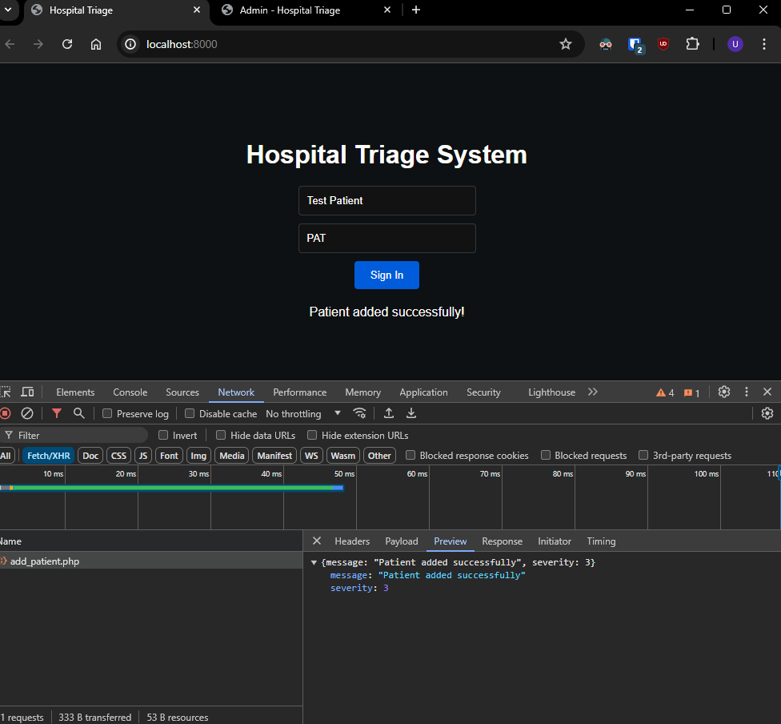
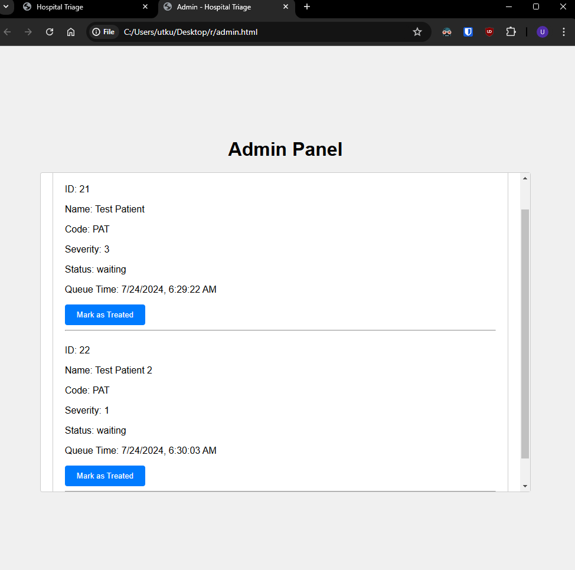
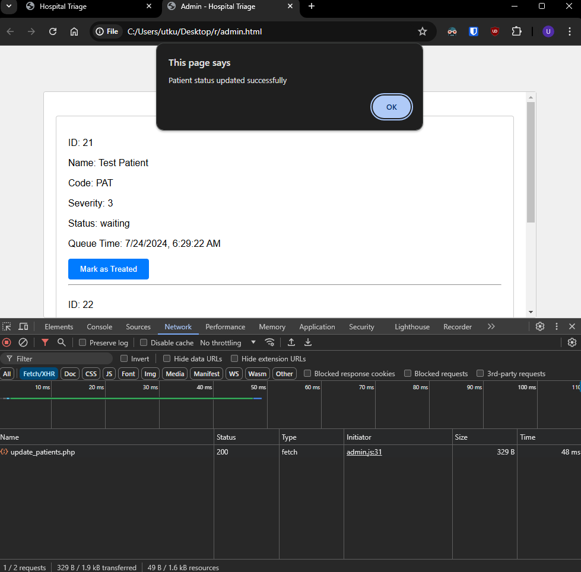
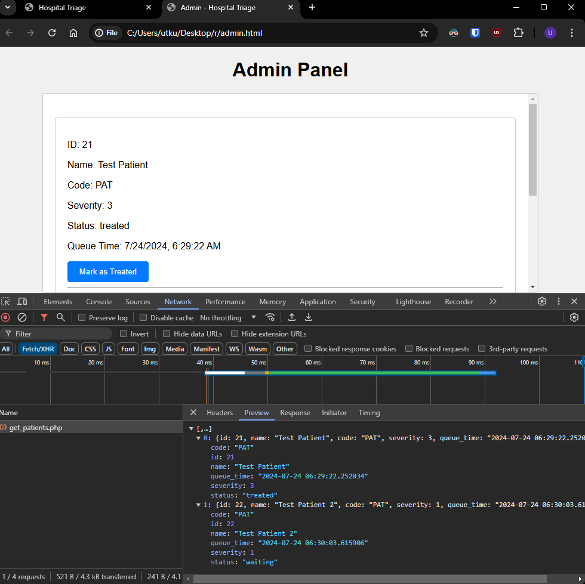
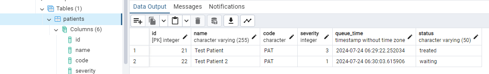

# Hospital Triage Application

## How to run locally
1. Clone this repository.
2. Create a new DB on pgAdmin
3. Create the table: 
    
    CREATE TABLE patients (
    id SERIAL PRIMARY KEY,
    name VARCHAR(255) NOT NULL,
    code CHAR(3) NOT NULL,
    severity INT NOT NULL,
    queue_time TIMESTAMP NOT NULL DEFAULT CURRENT_TIMESTAMP,
    status VARCHAR(50) DEFAULT 'waiting'
);

4. Navigate to project directory on command prompt and run php -S localhost:8000

## Usage
1. Open index.html and enter patient information
2. The application will assign a random severity and display the estimated wait time
3. Open admin.html to see or treat the patients 

